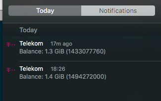

Command line application for interacting with the http://www.telekom.hu website.

Currently it can only login and get the mobile data usage limit.
If you wrap it with `Platypus <http://www.sveinbjorn.org/platypus>`_ and call limit command with
the ``--platypus`` option, it will show a notification on OS X.

